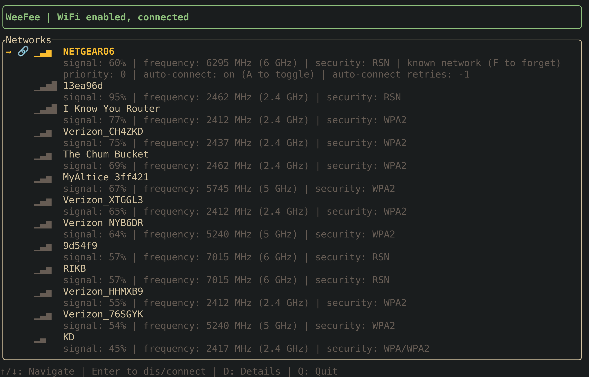

# weefee

A terminal UI for managing WiFi networks on Linux. Like `nmtui` but more intuitive.

weefee is designed to work with [NetworkManager](https://networkmanager.dev/).



## Installation

```bash
nix run github:samuela/weefee
```

Or install it:

```bash
nix profile install github:samuela/weefee
```

## Features

- Browse available WiFi networks with signal strength indicators
- Connect to networks (prompts for password when needed)
- Disconnect from the current network
- Forget saved networks
- Toggle auto-connect for known networks
- Detail view with signal strength, frequency/band, and security info
- Warnings for insecure networks (open/WEP)
- Vim-style keybindings

## Keybindings

| Key       | Action               |
| --------- | -------------------- |
| `j` / `↓` | Move down            |
| `k` / `↑` | Move up              |
| `Enter`   | Connect / Disconnect |
| `d`       | Toggle detail view   |
| `f`       | Forget network       |
| `a`       | Toggle auto-connect  |
| `q`       | Quit                 |

## Notes on implementation, coding agents, and codebase state

weefee is the product of my personal frustrations with nmtui and an experiment in vibe coding a TUI application. Most of the code is written by claude code. In my experience with this project, claude code got to a working prototype an order of magnitude faster than I would have manually, but there are a number of structural design decisions in the codebase that still do not sit well with me and thus far I have struggled to wrangle claude code into fixing these larger design issues. (I used Sonnet 4.5 for the majority of development. I have sinced switched to Opus 4.5 which I find to be noticeably more intelligent. Perhaps Opus would fare better.) Specifically, I would prefer for the UI implementation to follow a more React-style design ([ink](https://github.com/vadimdemedes/ink) is worth checking out). The current implementation is a slightly messy imperative beast that claude code hobbled together piece by piece. To some extent, it is hard to fault claude code here: I am not aware of widely-accepted a React-style paradigm or library in the Rust ecosystem that plays nicely with Rust's ownership model. https://github.com/veeso/tui-realm/ is the closest that I am aware of. \

It is an interesting question IMHO to study what memory models a React-style programming model actually requires. Perhaps garbage collection is necessary to get an ergonomic React or functional reactive programming model? Or maybe something in between Rust ownership semantics and full garbage collections is sufficient? Arenas? Something else entirely?

Limitations in Rust NetworkManager bindings (https://github.com/zibebe/networkmanager-rs) necessitates us spawning `nmcli` subprocesses for some features.

Despite these quirks, weefee is perfectly functional. I get mileage out of it. It is yet another experience that has reinforced for me that the economics of software engineering have fundamentally changed. It is now significantly cheaper to produce imperfect but functional code. But designing sane, safe, and elegant frameworks, interfaces, and programming models remains out of reach, at least at the time of writing. As a perfectionist, I am forced to admit that sometimes getting something 90% correct 10x faster is worthwhile.
